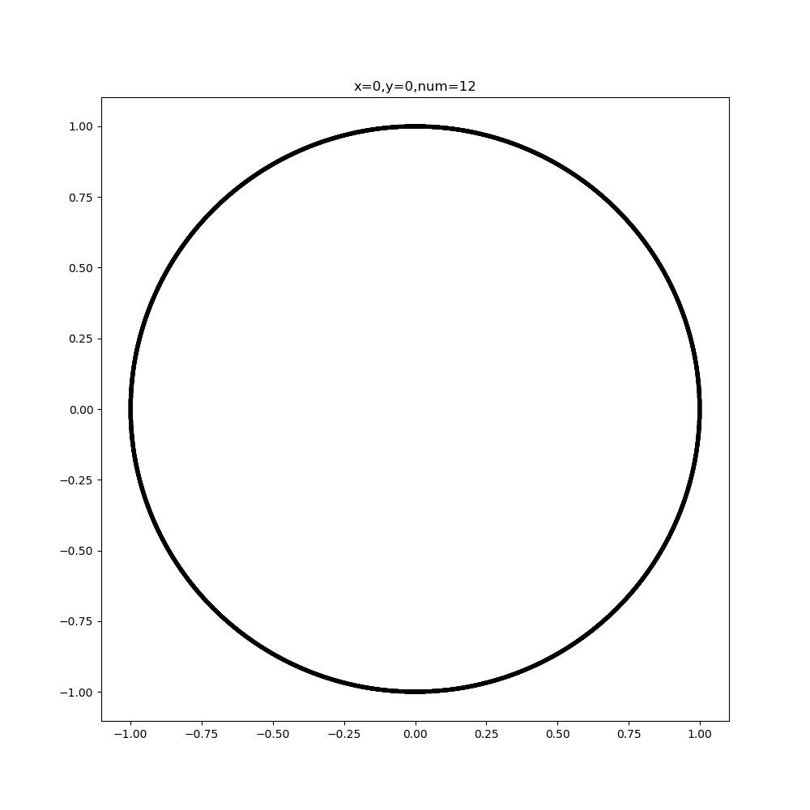
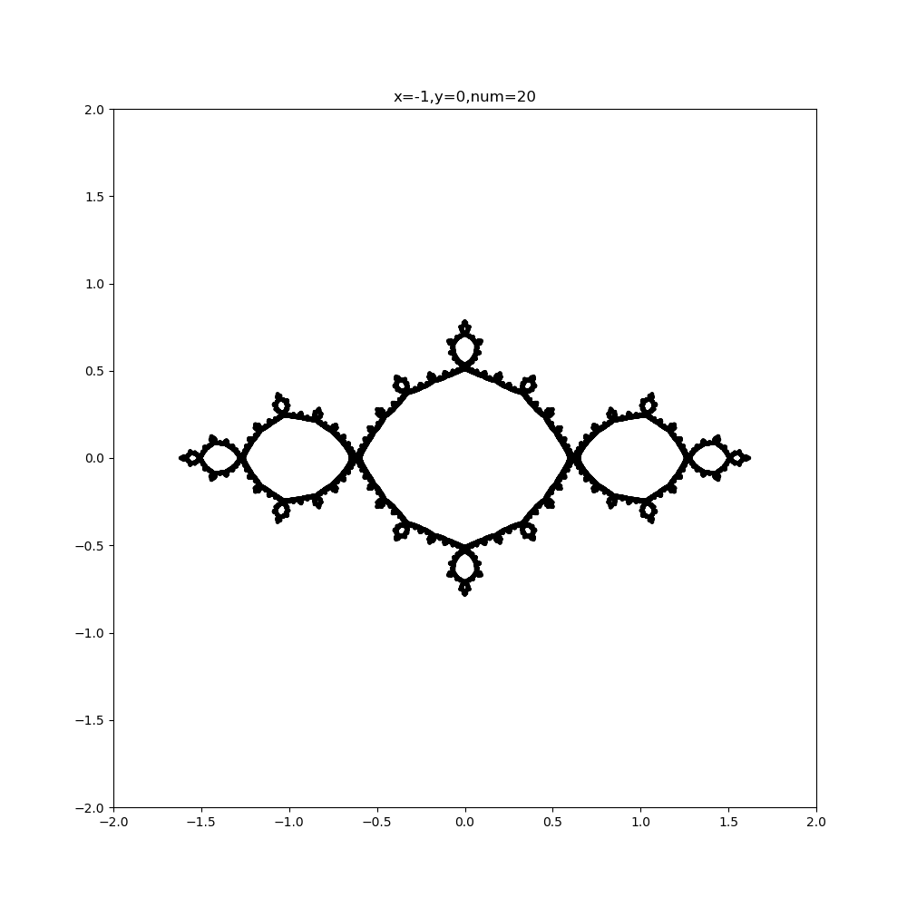
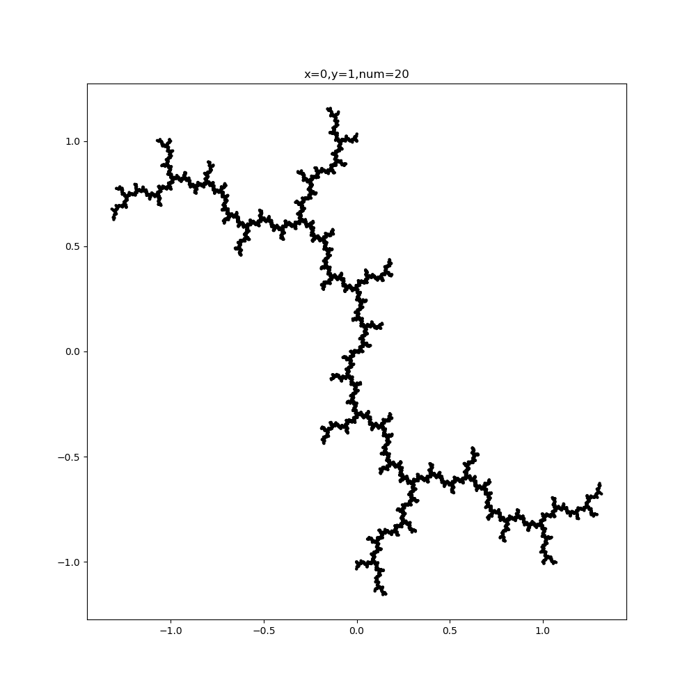
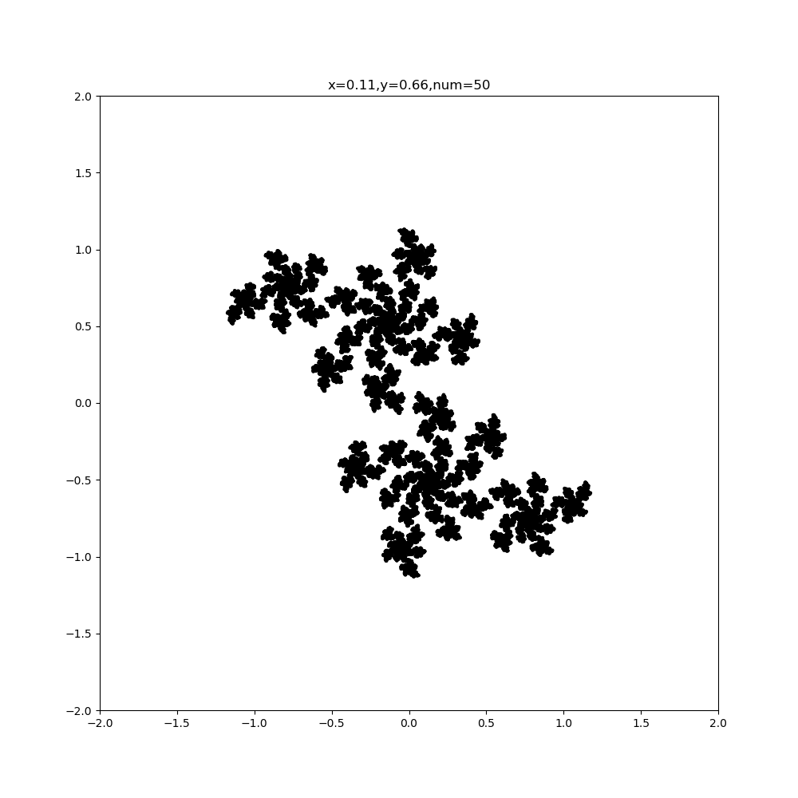
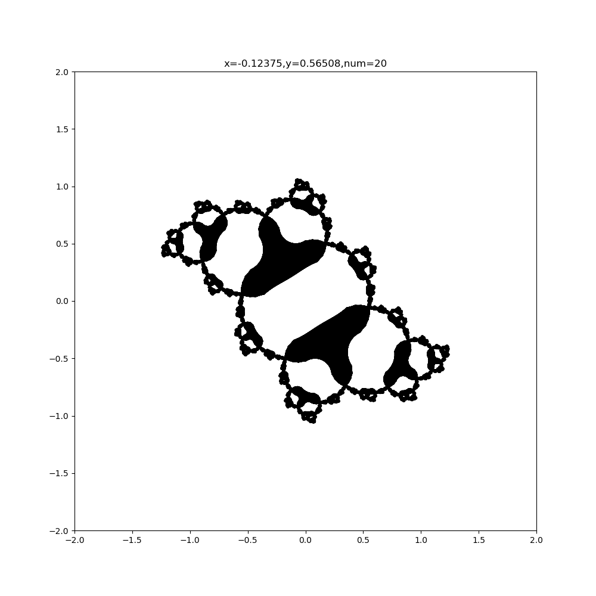

## <center>**计算物理 作业报告2**</center>

<center>PB16000647 羊达明</center>

#### **题目:**
在复平面上任选一个参数 $C=a+ib$，画出该 $C$ 值下的Julia集。

<br>

#### **算法思路:**

Julia 集的大致含义如下：

对于复平面上任意一点 $Z = x + i y$ ，利用方程 $Z_{n+1} = Z_n^2 + C$ 开始进行多次迭代。在我们设定的逃离范围内仍未逃离的点集组成 Julia 集。

其中迭代方程展开得到方程 $(1)$ :

$$Z_{n+1} = (x^2_n-y^2_n) + a + i(2x_ny_n+b)  \tag{1}$$

拆开得到两个实数方程 $(2), (3)$ :

$$ x_{n+1} = (x_n^2 - y_n^2) + a \tag{2}$$

$$ y_{n+1} = 2x_ny_n + b \tag{3}$$

程序中具体判断复平面上的点$(x,y)$是否属于 Julia 集的条件如下：

将初始点 $z_{0}$ 代入方程 $(2)(3)$ 迭代 $num$ 次后得到点 $z_{n}$，判断迭代后 $z_{n}^2 = x_{n}^2+y_{n}^2$ 是否小于某个半径 $R$; 同时，当原点$(0,0)$是方程吸引子时，还应该把那些迭代后靠近原点的点去掉。故判断条件为

$$ ZERO < |z_{n}| < RADIUS \tag{4}$$

在程序中设置为 $RADIUS = 200​$ ，$ZERO = 0.00000001​$。需要注意的是，若内部的吸引子不是原点， $ZERO$ 的值调大后会更接近实际情形，下面也会给出一个例子。

另一方面，在程序中只考虑 $[-2,2]\times[-2,2]的区域$，以 $STEP = 0.001$ 为步长进行循环。Julia 集最终形状由 $C=x+iy$ 决定。

#### **程序使用说明:** 

编程环境：**Ubuntu(zsh) / gcc / Python**

- ``julia.c``       输出 Julia集
- ``julia``         是``julia.c``编译后的可执行文件
- ``plot.py``       绘制单色的 Julia 集
- ``julia_color.c`` 输出包含迭代次数的 Julia 集
- ``julia_color``   是``julia_color.c``编译后的可执行文件
- ``plot_color.py`` 绘制彩色的 Julia 集
- ``julia.sh``      把上述单色Julia部分整合在一起执行的shell脚本，若shell非zsh可用``bash julia.sh``来执行
- ``julia_color.sh``把上述彩色Julia部分整合在一起执行的shell脚本

在终端中执行以下命令执行julia：

```shell
$ ./julia.sh 0 1 20

# C = x0 + i * y0
# 第一个参数为x0
# 第二个参数为y0
# 第三个参数为迭代次数（越高的话剩余的点会越少，一般取值在10-50间）
```
得到以下文件：
- test_0_1_20.png

对于julia_color则是：
```shell
$ ./julia_color.sh 0 1 8

# C = x0 + i * y0
# 第一个参数为x0
# 第二个参数为y0
# 第三个参数为迭代次数（越高的话剩余的点会越少，一般取值在5-10间）
```
得到以下文件：
- test_0_1_8.png

<br>

#### **Julia集结果:** 

- C = 0



- C = -1



- C =  i



- C = 0.11 + i 0.66



- C = -0.12375 + i 0.56508

这个比较特殊，内部吸引子非零。故我把 $ZERO$ 调大至0.1，不然内部会全部在 Julia 集内。



#### **彩色Julia图:**


