## <center>**计算物理 作业报告3**</center>

<center>PB16000647 羊达明</center>

#### **题目:**
进行单中心**扩散限制凝聚** (Diffusion-limited Aggregation,DLA)模型的模拟，并用两种方法计算模拟得到的DLA图形的分形维数，求分形维数时需要作出双对数图。

<br>

#### **算法思路:**

**DLA模拟**

模拟DLA的过程分以下几个步骤
- 初始化边界，网格，凝聚中心
- 在一定范围内随机产生粒子，并进行随机行走
- 当粒子与团簇相遇时停止运动，成为团簇的一部分
- 重复前两步
  
其中需要注意的几点是：
1. 所谓网格用大数组实现，团簇占有部分取值为1，不然为0
2. 产生随机粒子的范围并非是整个初始化时的边界内，而是随着团簇动态变化的一个区域，称为动态边界
3. 粒子随机行走方向有八个，即上、下、左、右、左上、左下、右上、右下
4. 当粒子超出动态边界时，处理方法是移动到相对的一侧动态边界（直接产生下一个随机粒子也可）
5. 粒子与团簇相遇即相邻

**分形维数**

采用Sandbox法和盒计数法计算分形维数
- **Sandbox法**

Sandbox方法简单来说是在越来越大的“盒子”中统计其中的粒子数，以此来计算分形维数。具体公式如下:
$$
N=r^D
$$
由此可以得到简单的代码实现：只要将原点放在凝聚中心，然后选取一系列“盒子”，统计每个大小盒子中点数目，时间复杂度为 $O(num_{particle} \times num_{box})$ 。

- **盒计数法**

盒计数法与Sandbox法相反，是取越来越小的盒子，其公式如下:
$$
N(\epsilon)=(1/\epsilon)^D
$$
实际在代码中利用模块$numpy$的内置矩阵可以比较简易地选取子块，可以实现盒计数法。

#### **程序使用说明：**

编程环境：**Ubuntu(zsh) / gcc / Python**

- ``dla.c`` 输出DLA模拟的结果，为指定长度的点集
- ``dla`` gcc 编译结果(Linux下可执行文件)
- ``plot.py`` DLA模拟的绘图程序
- ``plot_sandbox.py`` 用sandbox方法计算分形维数，并绘制双对数图
- ``plot_boxcounting.py`` 用boxcounting方法计算分形维数，并绘制双对数图
- ``dla.sh`` 整合了上述文件的shell脚本，可以比较方便批量计算

在终端中执行以下命令执行julia：

```shell
$ ./dla.sh 100000

# 参数为粒子总数
```
此时实际在执行以下指令：

```shell
gcc dla.c -o dla
./dla 100000 > test_100000
python plot.py 100000
python plot_sandbox.py 100000
python plot_boxcounting.py 100000
mkdir result_100000 && mv *_100000* ./result_100000
```

在终端中会有以下输出:
```shell
final dynamic border: 182
total particles: 10000328
```
得到文件夹``result_100000``，包含以下文件：
- test_100000
- dla_100000.png
- sandbox_100000.png
- boxcounting_100000.png

#### **结果:**

- 5000个粒子

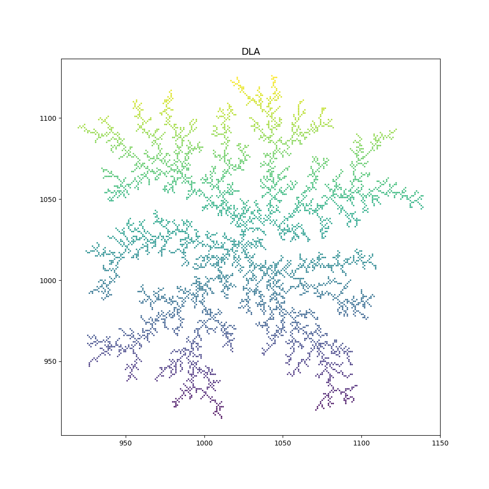

用 $sandbox$ 和 $boxcounting$ 得到的分形维数分别如下:

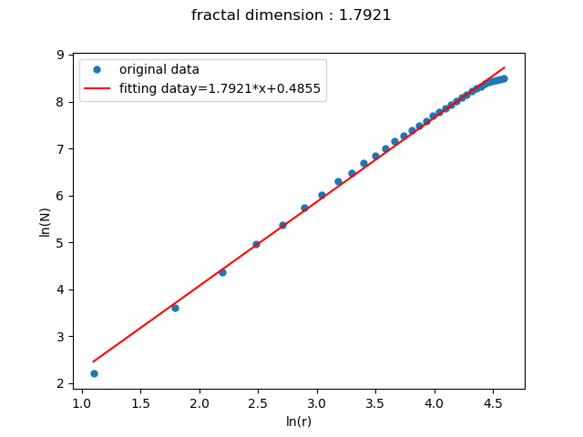

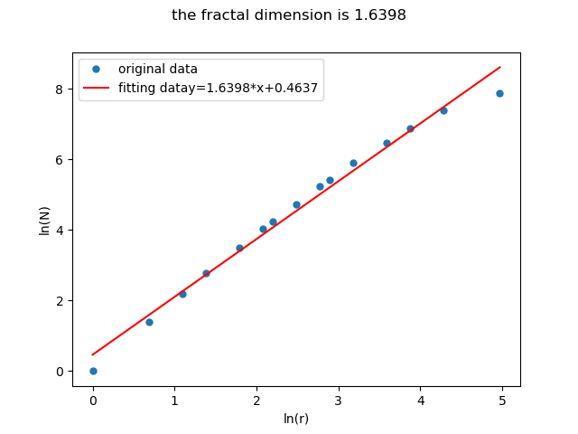

- 10000个粒子 (分形维数顺序是 $sandbox$ ，$boxcounting$)

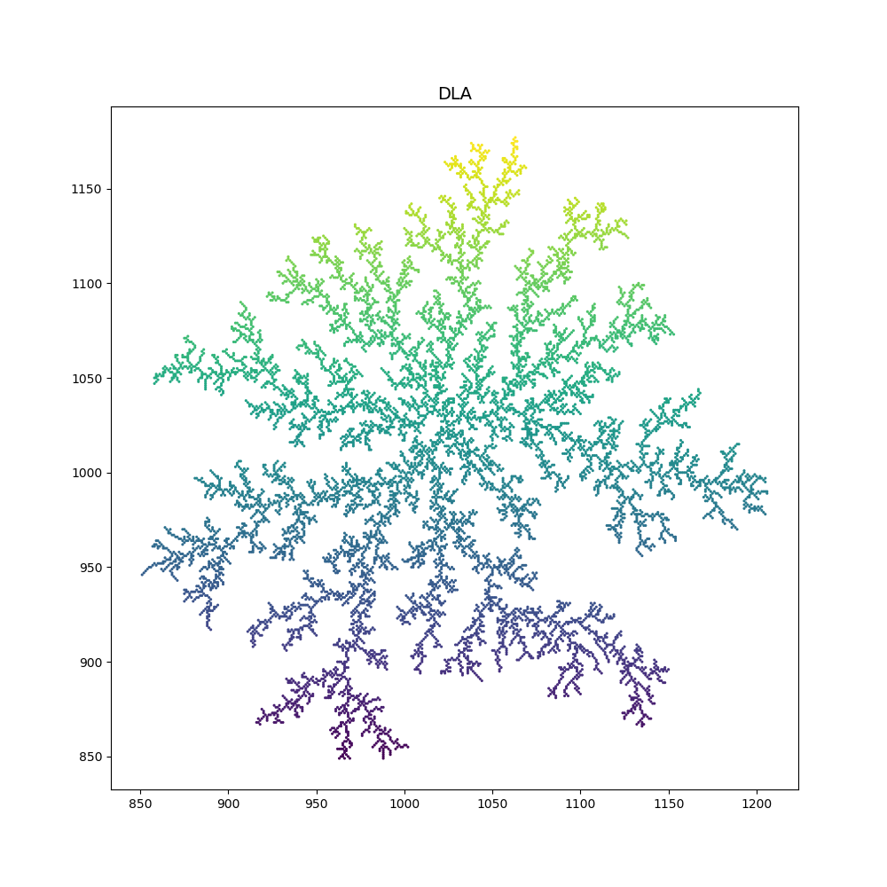

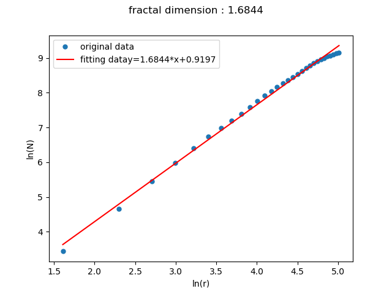

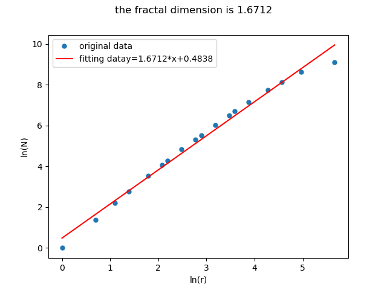

- 50000个粒子 (分形维数顺序是 $sandbox$ ，$boxcounting$)

  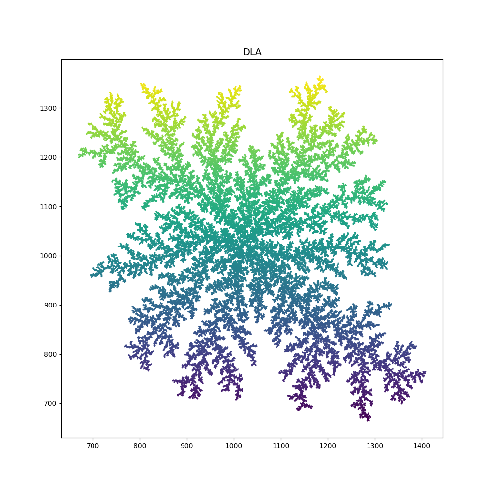

  

  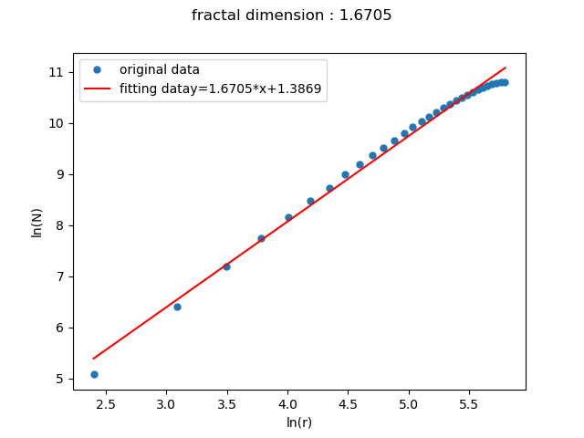

  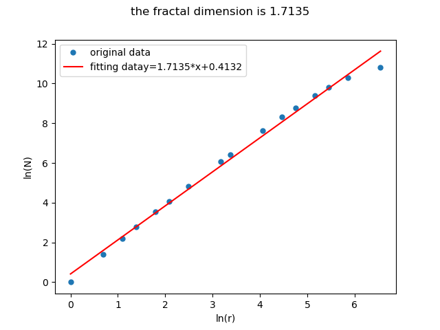

- 100000个粒子：

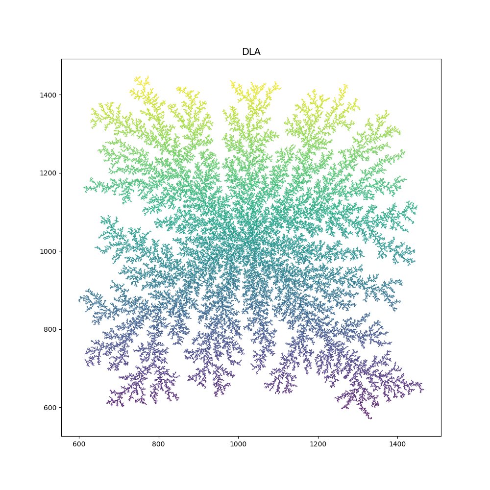

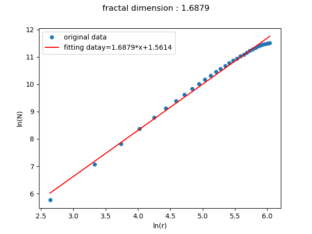

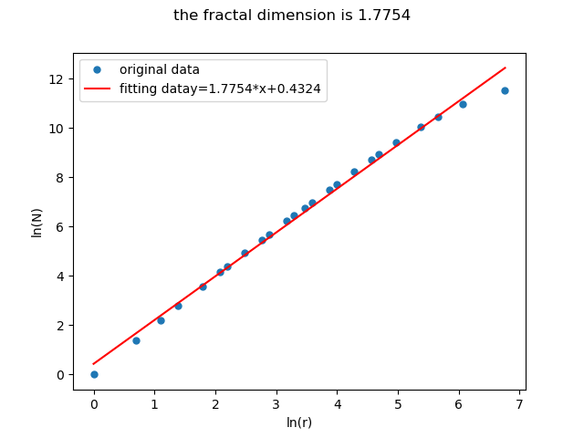

- 200000个粒子：

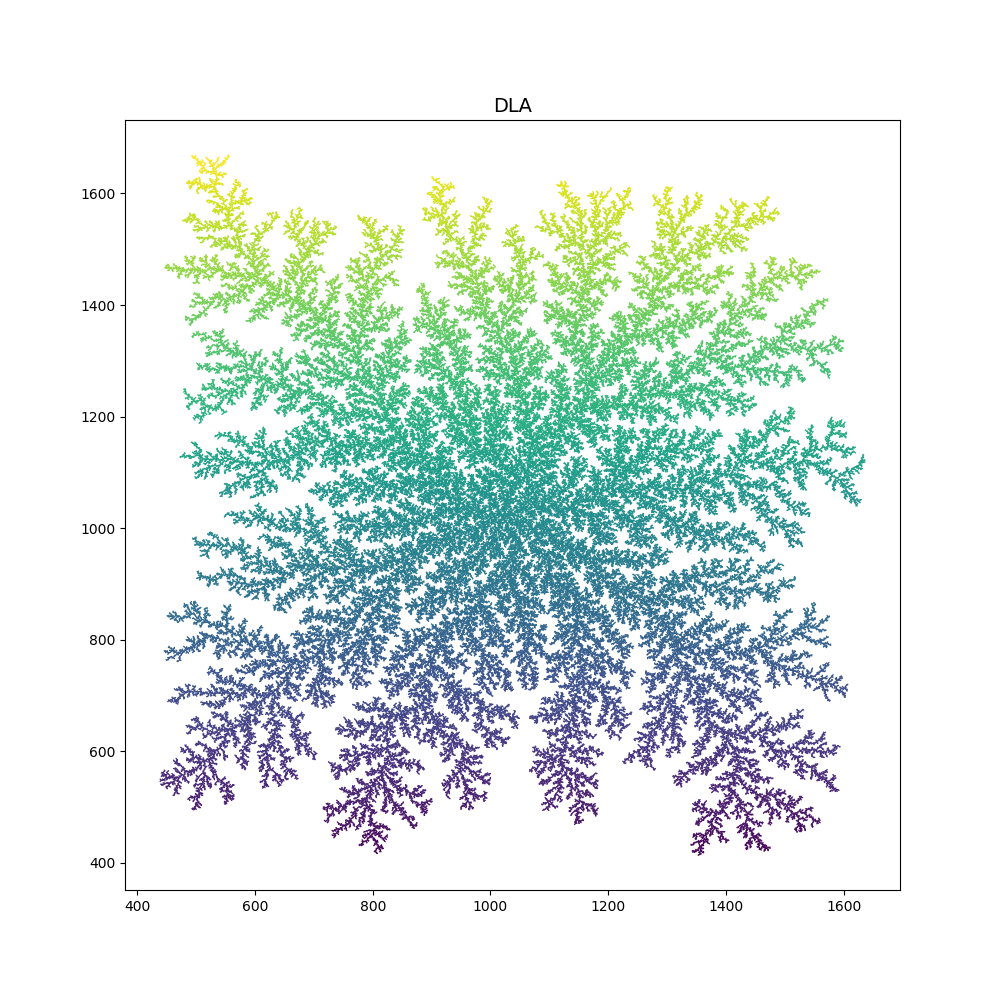

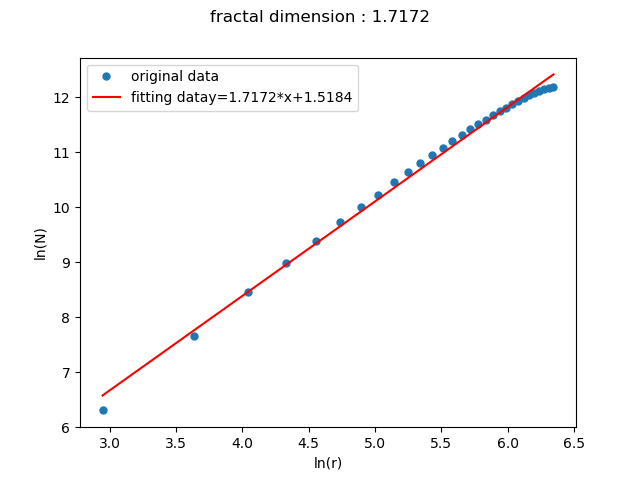

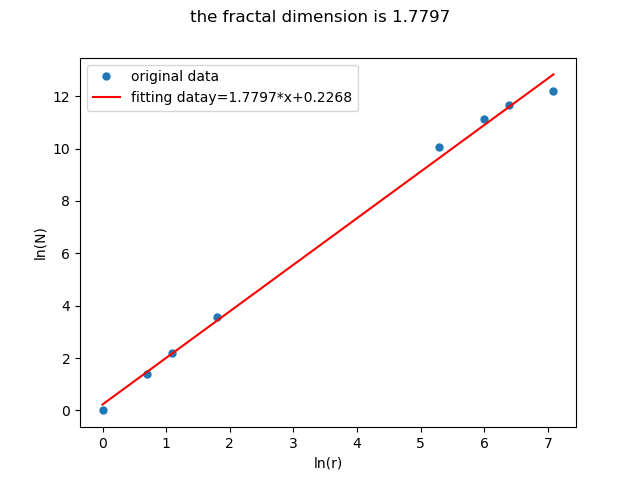

