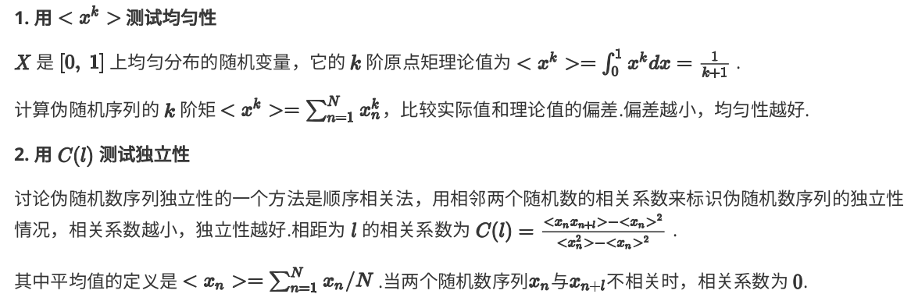
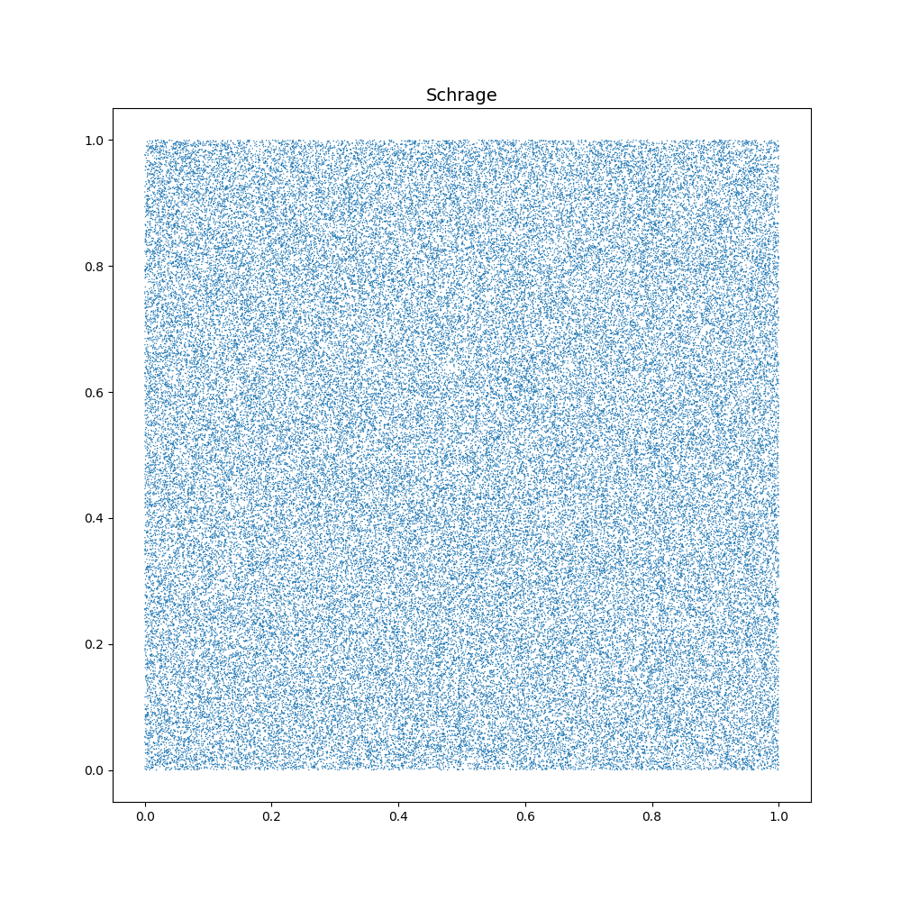
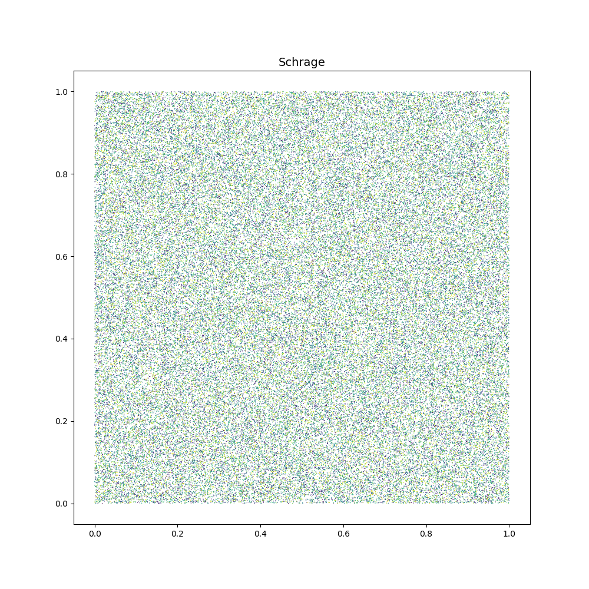
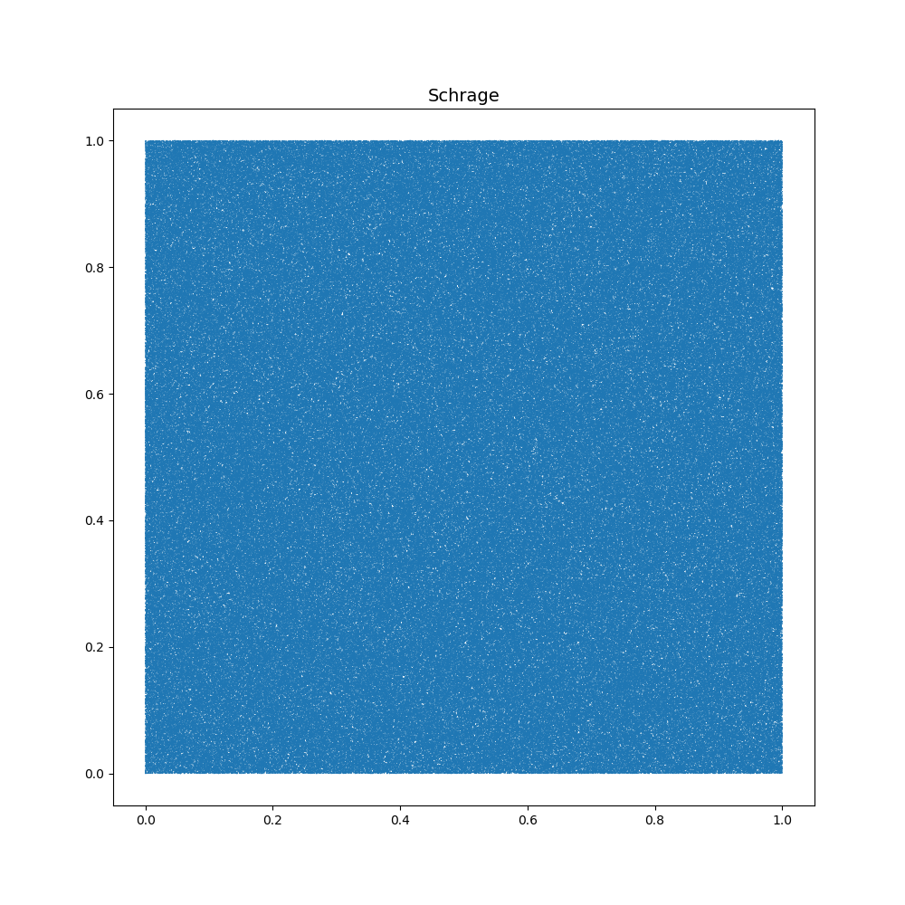
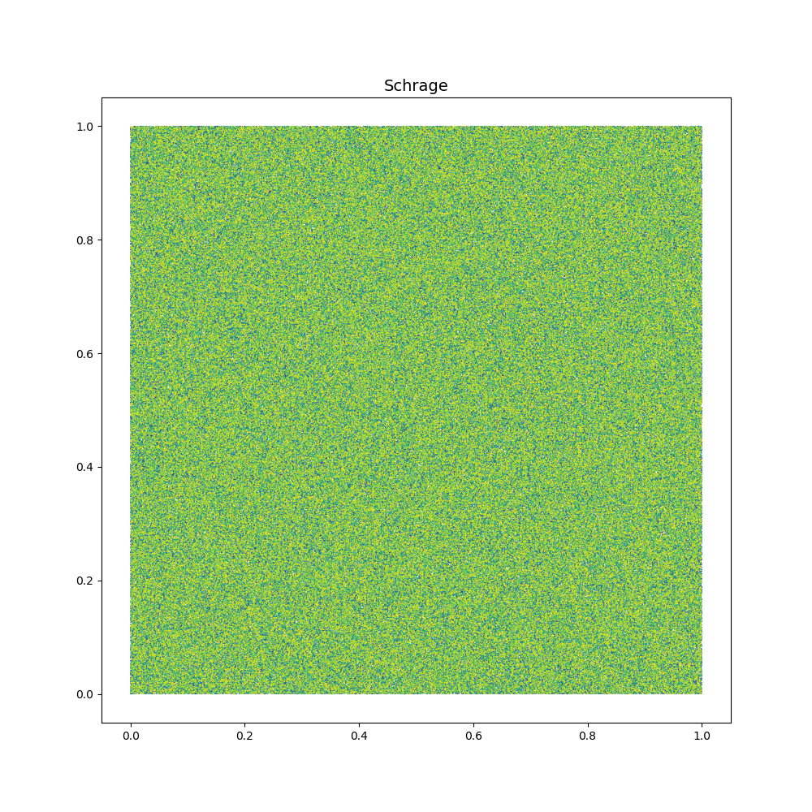
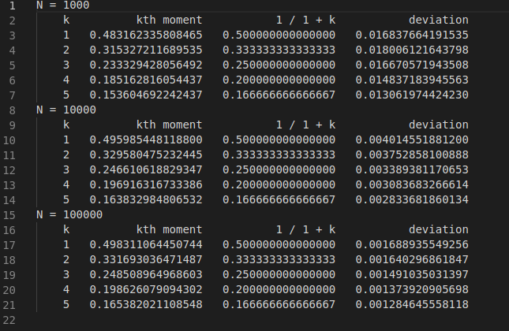
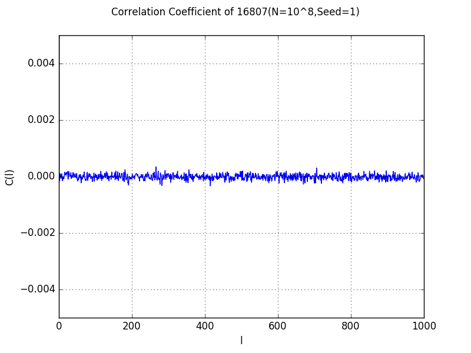
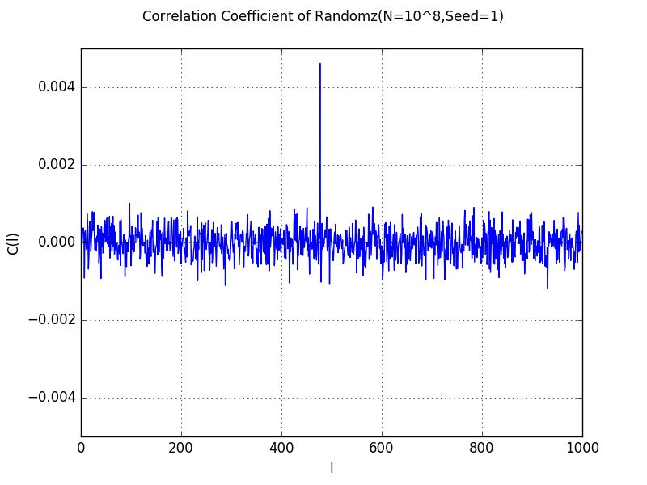

## 计算物理 实验报告4

羊达明 PB16000647 

用Schrage方法编写随机数子程序，用连续两个随机数作为点的坐标值绘出若干点的平面分布图。再用 $<x^k>$ 测试均匀性（取不同量级的N值，讨论偏差与N的关系）、C(l) 测试其2维独立性（总点数 $N > 10^7$）。

两种检验方法具体实现如下：

结果 ：

N = 100000, seed = 2333

带颜色的图不同颜色表示不同生成顺序，可以看出这个也是很均匀的。

N = 1000000, seed = 42

k阶矩的可读结果都在输出文件kth_order_*中，对应上面两个例子

简图如下：

除了上面例子外还跑了各种N的值的情形，N越大，实验值与理论值越接近。

C(l)测试二维独立性的结果在输出文件correlation_*中可以看到，两个可视化结果如下：

独立性都还可以。
