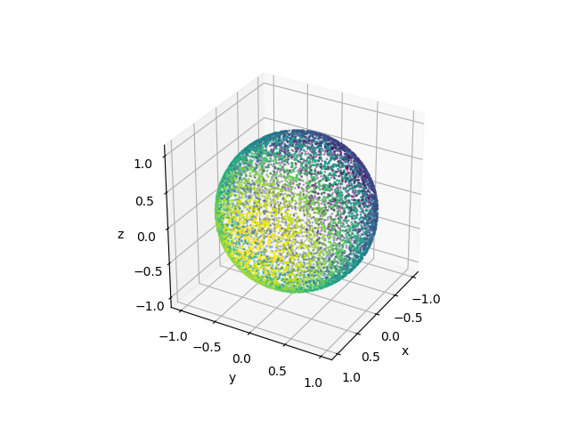

## <center>计算物理 作业报告7</center>

<center>PB16000647 羊达明</center>

#### **题目:**

对于球面上均匀分布的随机坐标点，给出它们在 $(x, y)$ 平面上投影的几率分布函数。并由此验证Marsaglia抽样方法确为球面上均匀分布的随机抽样。

#### **理论分析:**

**xy平面投影的分布函数**

设球面上均匀分布的随机坐标点在 $x-y$ 平面上投影的分布函数为 $g(x,y)$，则有:
$$
p(\theta,\phi)sin\theta d\theta d\phi=g(x,y)\left| \frac{\partial(x,y)}{\partial(\theta,\phi)} \right|d\theta d\phi
$$

由
$$
\begin{equation} \left\{ \begin{aligned} x=sin\theta cos\phi \\ y=sin\theta sin\phi \\ \end{aligned} \right. \end{equation}
$$

可得
$$
\left| \frac{\partial(x,y)}{\partial(\theta,\phi)} \right|=sin\theta cos\theta
$$

需要注意的是此处 $p(\theta,\phi)=\frac{1}{2\pi}$，最后得到:
$$
g(x,y)=\frac{1}{2\pi\sqrt{1-(x^2+y^2)}}
$$

**Marsaglia抽样方法**

三维球面的Marsaglia抽样方法如下：
1. 随机抽样均匀分布的随机数 $u,v\in[-1,1]$
2. $r^2=u^2+v^2$，若 $r^2>1$ 则重新抽样直至小于等于1
3. $x=2u\sqrt{1-r^2},y=2v\sqrt{1-r^2},z=1-2r^2$

在xy平面上，同上面的过程同样有：
$$
Cp(u,v)du dv=g(x,y)\left| \frac{\partial(x,y)}{\partial(u,v)} \right|du dv
$$

同时满足归一化条件:
$$
\int\int g(x,y)dxdy=1
$$

也可以得到
$$
g(x,y)=\frac{1}{2\pi\sqrt{1-(x^2+y^2)}}
$$

#### **模拟验证:**

使用第六题的程序。由分布函数可以看出越靠近中心，密度越小。同时角向也应该是均匀的。

对于Marsaglia抽样，可以设计模拟抽样后观察是否具有相同结果。

#### **程序使用说明：**

编程环境：**Ubuntu(zsh) / gcc / Python**

- ``sample.c`` 第六题的程序，给出球面均匀分布的直接抽样
- ``sample`` sample.c使用gcc编译结果(Linux下可执行文件)
- ``marsaglia.c`` 给出marsaglia抽样方法的随机点
- ``marsaglia`` marsaglia.c使用gcc编译结果
- ``plot.py`` 3d图，其中颜色代表x轴方向坐标
- ``plot_2d.py`` 2d图，是投影到x-y平面结果

在终端中执行以下命令执行sample：

```shell
$ ./sample > test_10000
# 输出文件标号对应sample.c中随机数总数

$ python plot.py 10000
$ python plot_2d.py 10000
```

得到以下文件：
- test_10000
- 3d_10000.png
- 2dxy_10000.png

在终端中执行以下命令执行marsaglia：

```shell
$ ./marsaglia > test_10000
# 输出文件标号对应sample.c中随机数总数

$ python plot.py 10000
$ python plot_2d.py 10000
```

得到以下文件：
- test_10000
- 3d_10000.png
- 2dxy_10000.png

#### **结果:**

**直接抽样的二维投影**

$N=5000$ :


**Marsaglia抽样**

$N=10000$ :




可以看到计算得到的图片满足理论推导出的分布的特征。