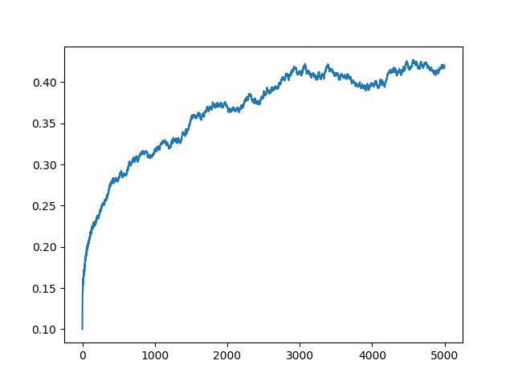

## <center>计算物理 作业报告8</center>

<center>PB16000647 羊达明</center>

#### **题目:**

在 $512\times512$ 的二维正方网格上,设置几个初始状态的自旋比例值,按照Q2规则Ising自旋动力学模型,模拟体系自旋状态随时间的演化,作图比较体系初始状态和平衡状态自旋的分布。

#### **模拟算法:**

本题要做的模拟简单说是要在二维网格上，依照Q2规则（一种演化规则），模拟Ising自旋动力模型。

假设每个格子只可能处于两种状态，自旋向上或向下，用1或0表示。所谓演化是指对于任一格子在下一时间点状态变化。特别地，Q2规则是由一个格子周围格子当前时间点状态给出中心格子下一时间点状态，并分别对"偶数"格、"奇数"格做演化。仅当中心格子周围格子1、0数目相同时，中心格子状态变化。

因此在程序中，有以下两个函数：
- ``int convert_odd ()``
- ``int convert_even ()``

这两个函数分别遍历两种格子，而后调用以下函数：
- ``int convert_cell (int line, int col)``

该函数判断格子是否满足状态变化的条件并完成演化。

初始时自旋向上的比例由使用者给出，并由程序随机产生对应比例数目的自旋向上(1)的格子，而后开始上述步骤。

#### **程序使用说明：**

编程环境：**Ubuntu(zsh) / gcc / Python**

- ``automata.c`` 第八题的程序，输出网格和自旋比例随时间的变化(一个test_i文件夹及count_i文件)
- ``automata`` automata.c使用gcc编译结果(Linux下可执行文件)
- ``plot.py`` 绘制出二维网格随时间变化的gif动图
- ``plot_ratio.py`` 绘制出自旋向上比例随时间变化的曲线

在终端中执行以下命令执行sample：

```shell
$ ./automata 10 > count_10
# 10代表初始的自旋向上占比

$ python plot.py 10
$ python plot_ratio.py 10
```
得到若干结果文件及一个文件夹：
- ./test10/
- count_10
- up_10.gif
- up_10.png

其中在./test10/文件夹中存放1000次（或更多次，在automata.c中更改）演化的结果。
count_10是这1000次自旋向上占比的变化；up_10.gif是对应的动图；up_10.png是绘制占比变化的结果。

#### **结果:**

初始占比：5%
(此处进行了10000次的演化，接近0%和100%的样例均进行了更多次数)


初始占比：10%



初始占比：20%


初始占比：30%


初始占比：50%


初始占比：60%


初始占比：80%


初始占比：90%


初始占比：95%


初始占比：99%
（这里只进行了1000次演化，大致观察一下趋势）


文件夹中保存了其中两个动图结果（比较大），其他的也可以使用上文描述的命令生成。

#### **讨论:**

状态的演化基本有两个特征：
- 是否趋于0.5
- 振荡是否剧烈

实验结果显示，除了部分初始比例较小的情形（对应较大比例应该也是如此，但实验中没展现出来），如5%的初始比例，其余样例均趋近于50%，当然初始比例越远，趋近的速度会更慢。而对于初始时是5%的情形，自旋向上比例在一个5.8%附近振荡（即既不是在50%附近，也不是在初始值附近）。

另外，如对比60%和80%，虽然都趋近于一个50%的平衡，但两者在50%附近波动的幅度有明显差异，这应该是和初始是随机产生向上的位置分布相关的。